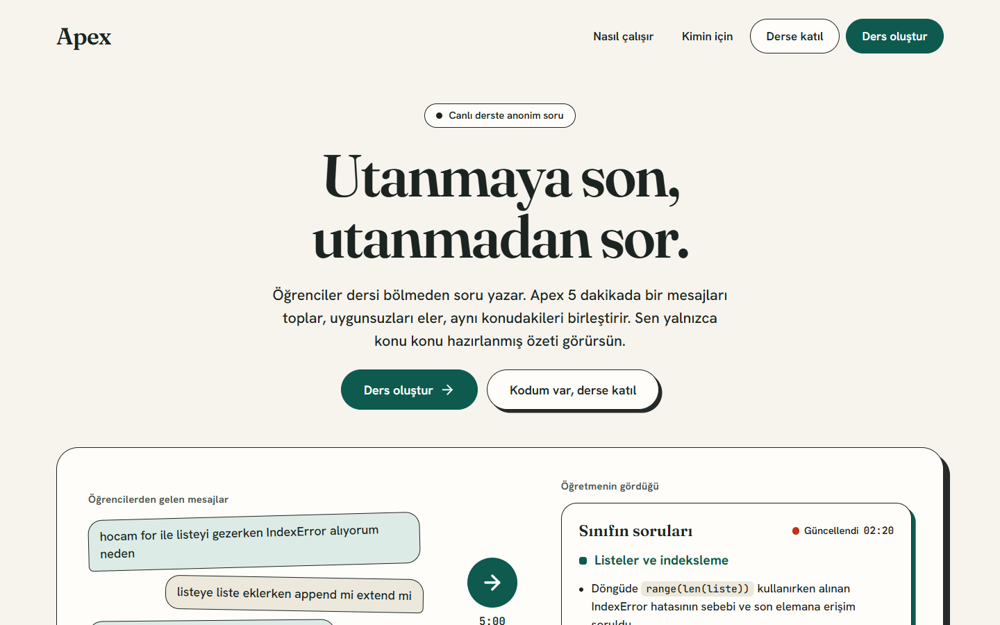
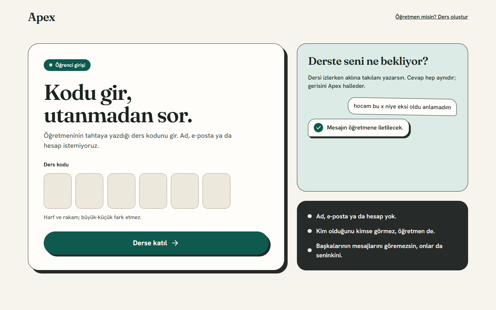
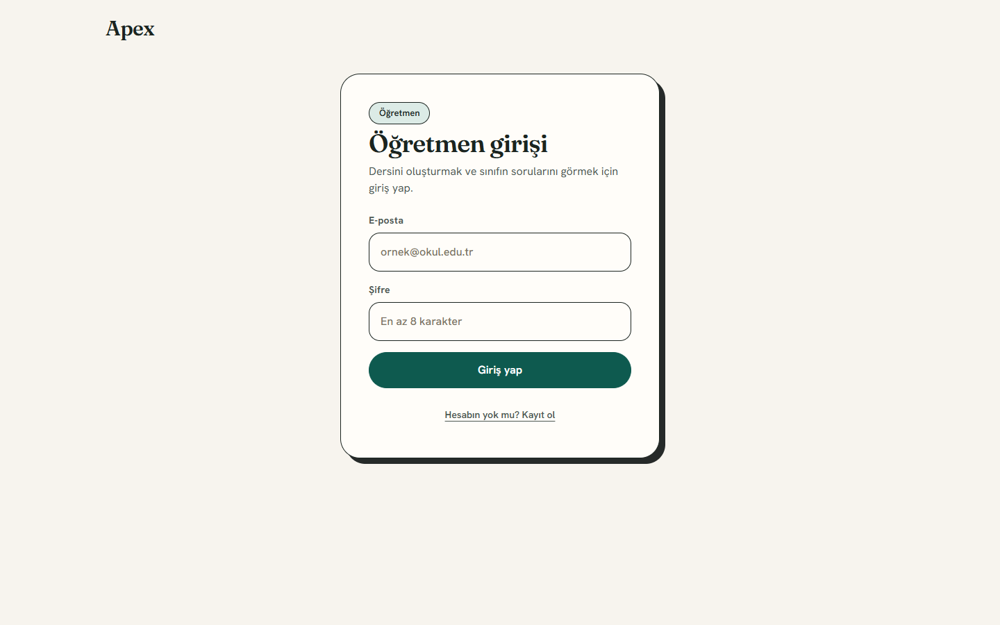
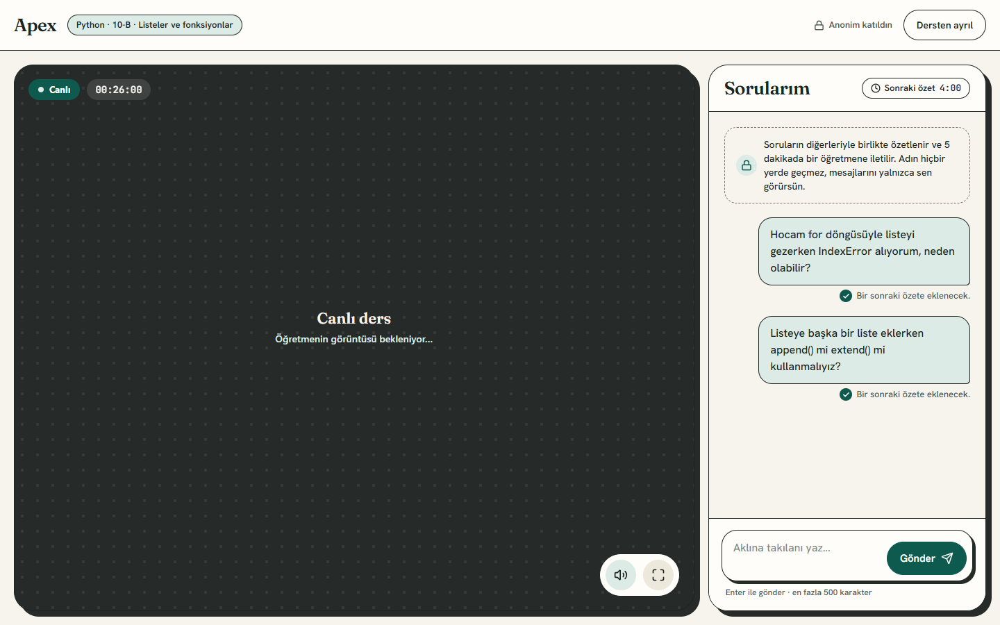
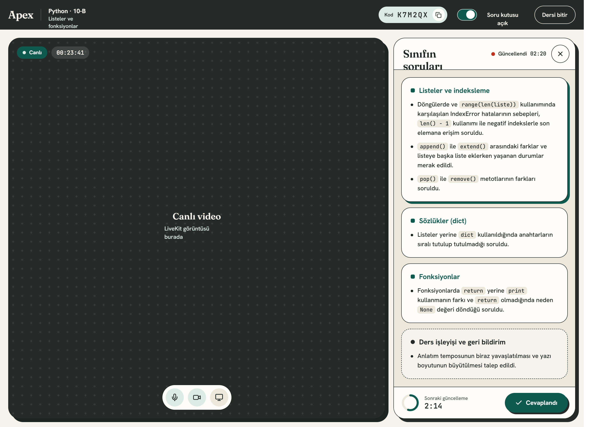
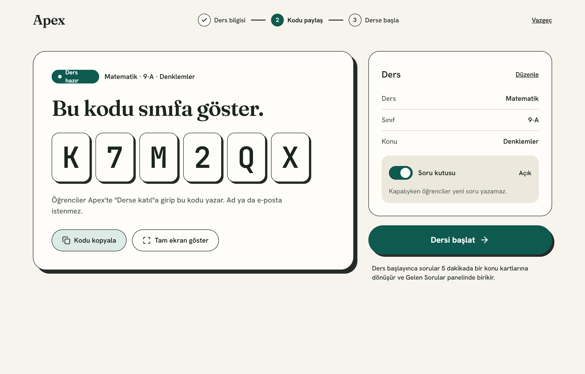

# Apex — Utanmaya son, utanmadan sor

> Canlı derste öğrenciler **anonim** soru yazar. Yapay zekâ mesajları toplar, uygunsuzları eler, aynı konudakileri birleştirir; öğretmen ham mesajlar yerine **tek bir okunabilir özet** görür.



---

## Sorun

- Öğrenciler sınıfın içinde soru sormaya çekiniyor ("herkesin içinde aptal görünürüm").
- Öğretmen ders anlatırken yazılı soruları takip edemiyor; sohbet akıyor, önemli sorular kayboluyor.

## Çözüm

Apex, öğrenci ile öğretmen arasında bir **aracı** gibi çalışır:

1. Öğretmen dersi açar, öğrencilere 6 haneli bir **kod** verir.
2. Öğrenci hesapsız, adsız, yalnızca kodla katılır ve canlı yayını izlerken soru yazar.
3. Mesajlar birikir; her **5 dakikada bir** yapay zekâ hepsini birlikte inceler.
4. Öğretmen panelinde ham mesaj yerine, konu başlıklarına ayrılmış **tek bir özet** görünür.
5. Öğretmen soruyu cevaplayınca **"Cevaplandı"** der; özet temizlenir, sonraki özet yalnızca yeni mesajlardan oluşur.

Yapay zekâ öğretmen değildir; öğrenciyle öğretmen arasındaki iletişimi düzenler.

## Ekranlar

| Öğrenci katılım | Öğretmen girişi |
|---|---|
|  |  |

### Öğrenci — canlı ders

Hesap yok, ad yok. Öğrenci yalnızca kendi sorularını görür; her mesajın altında "Bir sonraki özete eklenecek." yazar. Sağ üstte bir sonraki özete kalan süre görünür.



### Öğretmen — canlı ders

Solda kamera ve ekran paylaşımı, sağda **"Sınıfın soruları"** özeti. "Ders işleyişi ve geri bildirim" başlığı her zaman en üstte çıkar; kod ifadeleri ayrı etiketle gösterilir. Altta bir sonraki güncellemeye kalan süre ve **"Cevaplandı"** düğmesi var. Süre beklenmek istemezse sayaç düğmesine basınca özet anında güncellenir.



### Öğretmen — ders hazır

Ders oluşturulunca katılım kodu paylaşılır, ders bilgileri düzenlenir ve "Dersi başlat"a basılır.



> Öğretmen ekranlarının görüntüleri tasarım dosyasından alınmıştır; uygulama bu tasarıma ölçülerek birebir uyarlandı.

---

## Yapay zekâ ne yapıyor?

Her turda (varsayılan 5 dakika) birikmiş mesajlar Gemini'ye **tek istekte** gider:

- **Moderasyon:** Küfür/hakaret, spam, alaycı ya da ders konusuyla ilgisiz ("troll") mesajlar öğretmene hiç gitmez. Abuse veya spam yapan öğrenci 5 dakika yazamaz.
- **Gruplama:** Aynı konudaki sorular tek başlık altında birleştirilir.
- **Özetleme:** Her başlığın altında kısa, doğal cümleler üretilir; anlam değiştirilmez, yeni bilgi eklenmez.
- **Geri bildirim:** "Hızlı anlatıyorsun", "yazı küçük" gibi yapıcı eleştiriler sansürlenmez, "Ders işleyişi ve geri bildirim" başlığında en üstte gösterilir.
- **Dayanıklılık:** Birinci Gemini modeli kota ya da hata verirse otomatik olarak ikinci modele geçilir. AI cevap vermezse mesajlar silinmez, bekler ve sonraki turda tekrar denenir.

## Gizlilik ve güvenlik

- Öğrenci **hesap açmaz**, ad ya da e-posta vermez.
- Öğretmen **ham mesajları görmez**, yalnızca özeti görür.
- Öğrenci başkalarının mesajlarını göremez.
- Yayın yetkisi (kamera/ekran) LiveKit token'ında sunucuda belirlenir; öğrenci istemci tarafında yetkiyi değiştiremez.
- Tarayıcı AI servisini **asla** çağırmaz; her istek `Next.js → AI servisi` yolundan geçer, API anahtarları sunucuda kalır.
- Veritabanında satır düzeyi güvenlik (RLS) açıktır; gizli anahtarlar yalnızca sunucu tarafında kullanılır.
- Sınırlar: ders başına 30 mesaj, mesaj başına 500 karakter, aynı metin 1 dakika içinde tekrar kabul edilmez. Öğretmen **soru kutusunu** tek tuşla kapatabilir.

## Mimari

```
 Tarayıcı (öğretmen / öğrenci)
      │ HTTP + Realtime            │ WebRTC
      ▼                            ▼
 ┌─────────────────┐          ┌───────────┐
 │ Next.js (web)   │          │ LiveKit   │
 │ + Supabase      │          │ (canlı    │
 └───┬─────────┬───┘          │  yayın)   │
     │         │              └───────────┘
     ▼         ▼
 Supabase   AI servisi (FastAPI)
 (DB, Auth, └─► Gemini (yedek modelli)
 Realtime)
```

| Katman | Teknoloji |
|---|---|
| Arayüz | Next.js 16 (App Router, Server Actions), React 19, Tailwind CSS v4, lucide-react |
| Canlı video | LiveKit (öğretmen yayınlar, öğrenci izler) |
| Veritabanı / Auth / Realtime | Supabase (Postgres, RLS, Realtime) |
| Yapay zekâ servisi | Python, FastAPI, Google Gemini (`/summarize-batch`) |
| Çalıştırma | Docker (AI servisi), Windows için `baslat.bat` |

## Klasör yapısı

| Klasör | İçerik |
|---|---|
| `web/` | Next.js uygulaması (sayfalar, bileşenler, sunucu eylemleri) |
| `ai-service/` | FastAPI yapay zekâ servisi (moderasyon + özet) |
| `supabase/migrations/` | Veritabanı şeması ve RLS politikaları |
| `docker/` | AI servisi için `docker-compose.yml` |
| `docs/screenshots/` | README ekran görüntüleri |
| `FAZ1.md` | Proje planı ve ürün kuralları |

## Kurulum

### 1. Web uygulaması

```bash
cd web
npm install
cp .env.example .env.local   # değerleri doldur
npm run dev                   # http://localhost:3000
```

`.env.local` içinde Supabase, LiveKit ve AI servisi değişkenleri bulunur (şablon: `web/.env.example`). Gizli anahtarlar **asla** commit edilmez.

### 2. Veritabanı

`supabase/migrations/` altındaki dosyaları sırayla Supabase projesine uygulayın (`0001_init.sql`, `0002_rls_initplan.sql`, `0003_lesson_summary.sql`).

### 3. AI servisi

```bash
cd ai-service
python -m venv venv && venv\Scripts\activate
pip install -r requirements.txt
cp .env.example .env          # GEMINI_API_KEY ve INTERNAL_API_KEY
python -m uvicorn app.main:app --port 8000 --reload
```

Docker ile: `docker compose -f docker/docker-compose.yml up -d ai-service`

### Hepsini birden (Windows)

`baslat.bat` AI servisini ve web uygulamasını ayrı pencerelerde başlatır.

## Test için faydalı ayarlar

| Ayar | Anlamı |
|---|---|
| `NEXT_PUBLIC_AUTO_ANALYSIS_SECONDS` | Otomatik özet aralığı (saniye). Boşsa 300 (5 dk), `0` kapatır. |
| `AI_MOCK=1` | AI servisi yerine sahte cevap döner. |
| `web/scripts/seed-test-messages.mjs` | Canlı bir derse test mesajları yükler (`--temizle` ile siler). |

## Ekip

| | Sorumluluk |
|---|---|
| **Alaaddin** | Web arayüzü, tasarım uygulaması, veritabanı, canlı video |
| **Ertuğrul** | Yapay zekâ servisi (moderasyon, gruplama, özet), Docker |

## Yol haritası

- Ders sonu raporu (hangi konuda kaç soru geldi)
- Okul / kurs hesapları ve çoklu öğretmen
- Ders arşivi ve geçmiş özetlere erişim
- Öğretmen için isteğe bağlı ham mesaj görünümü
